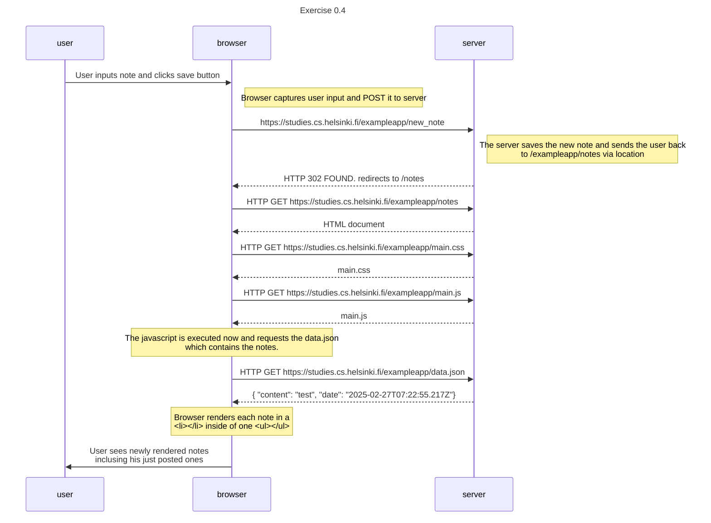

```mermaid

sequenceDiagram title Exercise 0.4
participant user
  participant browser
  participant server

user->>browser: User inputs note and clicks save button

Note right of browser: Browser captures user input and POST it to server
browser->>server: https://studies.cs.helsinki.fi/exampleapp/new_note 

Note right of server: The server saves the new note and sends the user back<br/> to /exampleapp/notes via location
server-->>browser: HTTP 302 FOUND. redirects to /notes

browser->>server: HTTP GET https://studies.cs.helsinki.fi/exampleapp/notes
server-->>browser: HTML document

browser->>server: HTTP GET https://studies.cs.helsinki.fi/exampleapp/main.css
server-->>browser: main.css 

browser->>server: HTTP GET https://studies.cs.helsinki.fi/exampleapp/main.js
server-->>browser: main.js
Note over browser: The javascript is executed now and requests the data.json<br/> which contains the notes.

browser->>server: HTTP GET https://studies.cs.helsinki.fi/exampleapp/data.json
server-->>browser: { "content": "test", "date": "2025-02-27T07:22:55.217Z"}

Note over browser: Browser renders each note in a<br/> <li></li> inside of one <ul></ul>
browser->>user: User sees newly rendered notes<br/> inclusing his just posted ones
```