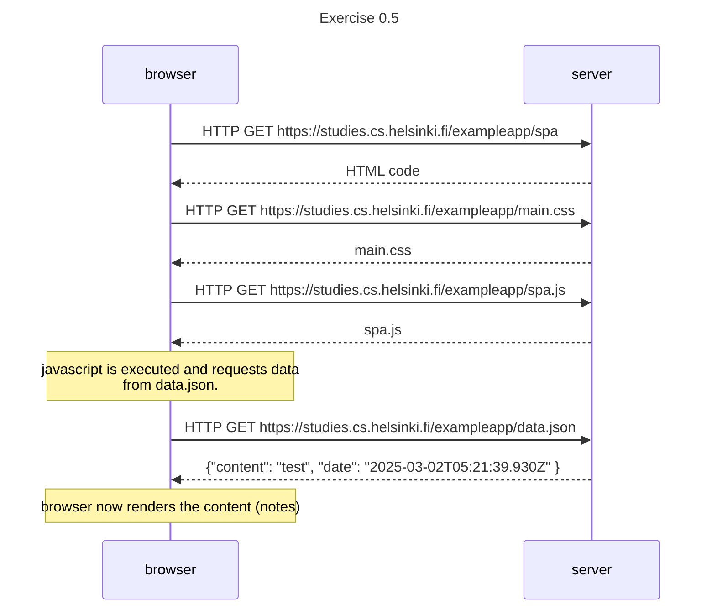

```mermaid

sequenceDiagram title Exercise 0.5
participant browser
participant server

browser->>server: HTTP GET https://studies.cs.helsinki.fi/exampleapp/spa
server-->>browser: HTML code 

browser->>server: HTTP GET https://studies.cs.helsinki.fi/exampleapp/main.css
server-->>browser: main.css

browser->>server: HTTP GET https://studies.cs.helsinki.fi/exampleapp/spa.js
server-->>browser: spa.js
Note over browser: javascript is executed and requests data<br />from data.json.

browser->>server: HTTP GET https://studies.cs.helsinki.fi/exampleapp/data.json
server-->>browser: {"content": "test", "date": "2025-03-02T05:21:39.930Z" }
Note over browser: browser now renders the content (notes)

```