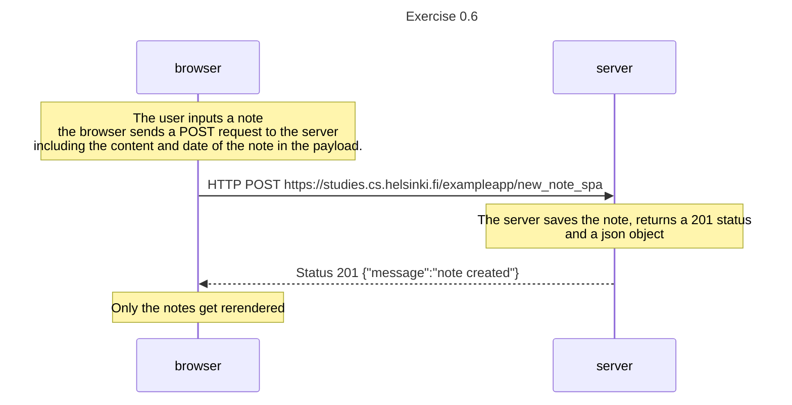

```mermaid

sequenceDiagram title Exercise 0.6
participant browser
participant server

Note over browser: The user inputs a note<br/> the browser sends a POST request to the server<br/>including the content and date of the note in the payload.
browser->>server: HTTP POST https://studies.cs.helsinki.fi/exampleapp/new_note_spa


Note over server: The server saves the note, returns a 201 status<br/> and a json object
server-->>browser: Status 201 {"message":"note created"}

Note over browser: Only the notes get rerendered
```
